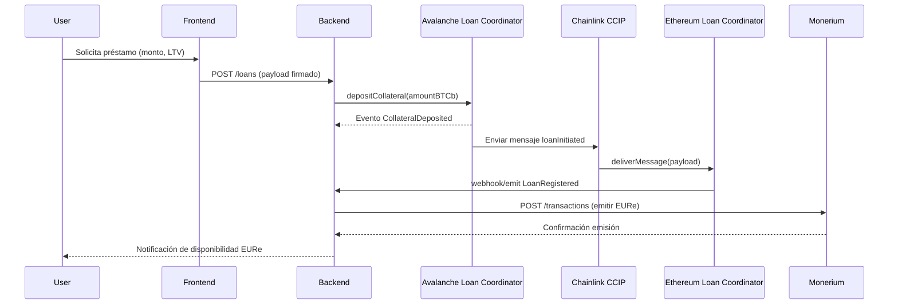
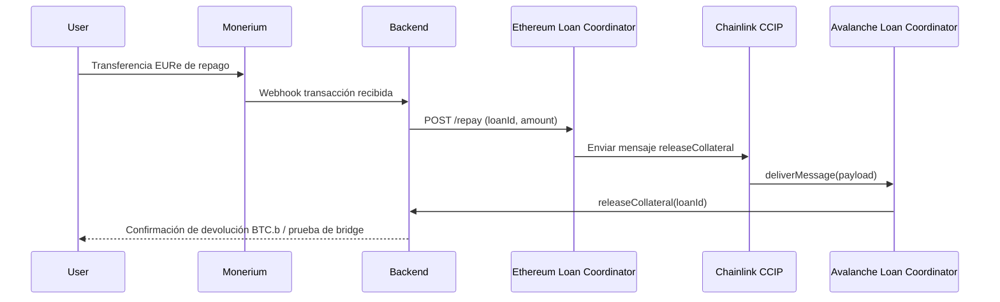
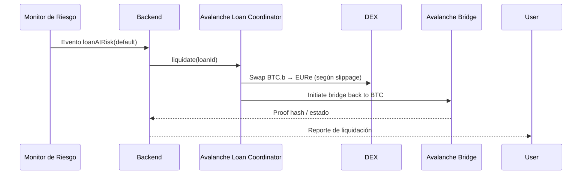

# Diagramas de Integración

Los siguientes diagramas describen los flujos entre contratos, backend y los
servicios externos (Monerium y Avalanche Bridge) relevantes para la auditoría.

## Flujo de originación de préstamo

## Flujo de repago

## Flujo de liquidación

Estos diagramas se basan en la implementación actual y deben validarse contra
las pruebas automatizadas y configuraciones de despliegue antes de la auditoría.
